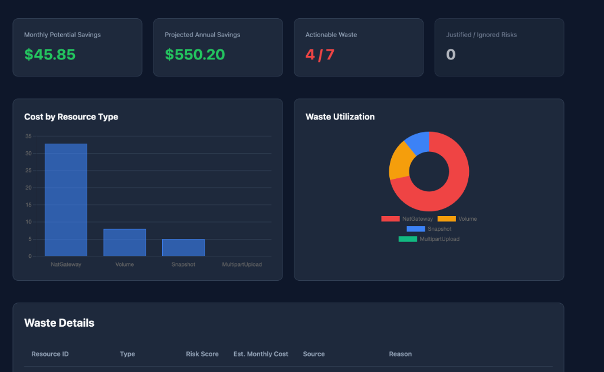

# CloudSlash

[CloudSlash Dashboard]


**The Forensic Accountant for AWS Infrastructure**

> **Status:** Precision Engineered. Zero Error.

CloudSlash identifies idle, orphaned, and underutilized resources in AWS environments. Unlike tools that rely solely on "Status" checks, CloudSlash correlates CloudWatch metrics with resource topology to find actual waste (e.g., available volumes with no IOPS, NAT Gateways with low throughput).


> **New to CloudSlash?** Check out the complete [**User Walkthrough**](WALKTHROUGH.md) for a step-by-step guide.

## License Model (Dual Licensed)

CloudSlash is **Open Source** (AGPLv3) to guarantee transparency and community freedom.

- **Community Edition (AGPLv3):** Free for personal use, audit, and contribution. If the source is modified and distributed, changes must be shared.
- **Commercial License (Standard):** Unlocks automated reporting, Terraform remediation, and support. Usage does not trigger copyleft provisions when used as an internal tool.
- **Enterprise License (AGPL Exception):** For organizations requiring **Indemnification** and a total exemption from AGPL. This license allows embedding CloudSlash source code into proprietary platforms.

## Core Capabilities

- **Zero Trust Scanning**: Verifies utilization via telemetry rather than metadata.
- **Read-Only**: Operates with `ViewOnlyAccess`. No write permissions required.
- **Graph-Based Detection**: Builds a resource dependency graph to calculate blast radius and identify connected clusters of waste.
- **Terraform Code Auditor**: Maps waste resources back to the exact file and line number in your local Terraform code (Reverse-Lookup).
- **Heuristic Analysis**:
  - **Zombie EBS**: Detects available volumes or attached volumes with 0 IOPS/30 days.
  - **Zombie Control Planes**: Identifies EKS Clusters that are active but have zero compute nodes (Node Groups, Fargate, or EC2) for > 7 days.
  - **Idle NAT Gateways**: Identifies gateways costing hourly rates but processing minimal traffic (<1GB/month).
  - **S3 Multipart Uploads**: Finds incomplete uploads consuming storage space.
  - **The Time Machine**: Recursively identifies snapshots created from waste volumes.
  - **Fossil Snapshots**: RDS Snapshots unlinked from any active cluster.
  - **Orphaned ELBs**: Load Balancers with zero requests.
  - **Loose EIPs**: Unassociated Elastic IPs.
- **Remediation**: Generates `waste.tf`, `import.sh`, and `fix_terraform.sh` for safe, managed cleanup.

## Key Differentiators

Unlike AWS Trusted Advisor, which primarily lists idle resources, CloudSlash offers:

1.  **Orphaned Resource Cleanup**: Generates scripts to remove resources that have detached from your infrastructure logic (e.g. Volumes left behind after termination).
2.  **Owner Forensics**: Traces CloudTrail logs to identify the IAM User or Role responsible for the resource creation.
3.  **Blast Radius Calculation**: Analyzes graph dependencies to ensure safe deletion of connected components.

## Installation

### macOS / Linux

Open a terminal and run the installer:

```bash
curl -sL https://raw.githubusercontent.com/DrSkyle/CloudSlash/main/dist/install.sh | bash
```

### Windows (PowerShell)

Run as Administrator:

```powershell
irm https://raw.githubusercontent.com/DrSkyle/CloudSlash/main/dist/install.ps1 | iex
```

> **Note:** CloudSlash installs to `/usr/local/bin` (Unix) or `%LOCALAPPDATA%` (Windows) and is available globally.

## Usage

### 1. Interactive Mode (Default)

Simply run the command to verify the environment and start the TUI.

```bash
cloudslash
```

### 2. Headless Scan (CI/CD)

Run without the UI for automated pipeline integration.

```bash
cloudslash scan --region us-west-2
```

### 3. Pro Mode (License)

Unlock full reporting and Terraform generation.

```bash
cloudslash --license YOUR_KEY_HERE
```

### 4. Auto-Update

CloudSlash checks for updates automatically. To upgrade manually:

```bash
cloudslash update
```

### 5. Safety Brake (Interactive Nuke)

Interactively delete identified waste with a confirmation safety net.

```bash

cloudslash nuke
```

### 6. Data Export

Generate CSV, JSON, and HTML reports without the interactive TUI.

```bash
cloudslash export
```

## Security

- **IAM Scope**: Requires only `ReadOnlyAccess`.
- **Data Privacy**: Analysis is performed locally. No credential or graph data leaves the machine.

## Uninstallation

To remove CloudSlash completely:

**macOS / Linux:**

```bash
sudo rm /usr/local/bin/cloudslash
```

**Windows:**

```powershell
Remove-Item "$env:LOCALAPPDATA\CloudSlash" -Recurse -Force
```

## Release History

### v1.2.3 (Current)

- **Zombie Control Planes**: Algorithm to detect abandoned EKS Clusters ($0.10/hr) by verifying compute capacity across Managed Node Groups, Fargate Profiles, and Self-Managed Instances.
- **Data Export**: New `cloudslash export` command for generating reports without user interaction.
- **Smart Suppression**: Added relative time support for ignore tags (e.g., `cloudslash:ignore=30d`).

### v1.2.2

### Core Engine

- **Robust Installer**: Now features a progress bar, pipe-safety, and auto-architecture detection (v1.2.2).
- **Auto-Update**: CloudSlash now identifies new versions and prompts you to upgrade.
- **Dynamic Versioning**: Smartly handles Pre-release and Stable tags for seamless upgrades.
- **Zero-Dependency**: Static binaries for Mac, Linux (x86/ARM), and Windows.

### Cost Intelligence

- **Real-Time Calculation**: Queries public AWS pricing APIs to value your waste.
- **Daily Burn Rate**: See exactly how much money you lose every 24 hours.
- **Annual Projection**: Forensics on how much you save per year by cleaning up.

### Forensics & Audit

- **Owner Identification**: Traces CloudTrail to find _who_ created the resource ("The Blame Game").
- **Reverse-Terraform**: Generates `fix_terraform.sh` to surgical remove waste from your `.tf` state.
- **Fossil Snapshots**: Detects RDS/EBS snapshots that have no active parent volume or cluster.
- **Silent Killers**: Identifies expensive "sleeping" costs like unattached NAT Gateways and massive Log Groups (>1GB).

### Remediation

- **Safety Brake**: `cloudslash nuke` now includes an interactive confirmation step.
- **Suppression Tags**: Mark resources as `cloudslash:ignore` to whitelist them from future scans.
- **Non-Destructive**: Defaults to Read-Only mode. Destruction requires explicit user intent.

### Usage Flow (Remediation)

1. **Scan**: Run `cloudslash` to identify waste.
2. **Review**: Check the dashboard and `waste_report.csv`.
3. **Suppress**: Run `bash cloudslash-out/ignore_resources.sh` to tag false positives.
4. **Fix**: Run `bash cloudslash-out/fix_terraform.sh` to update state (Pro).

## Architecture

Built in Go. Uses an in-memory graph to model resource relationships. The TUI is powered by Bubble Tea. The CLI is extensible via `Cobra`.
